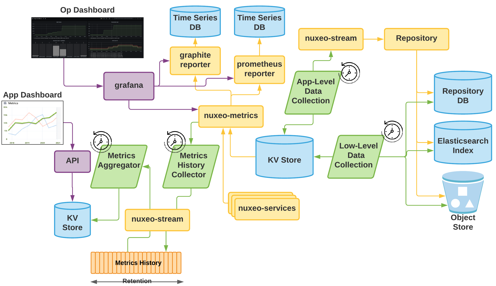

# Nuxeo Statistics

This addons allows precomputing statistics with custom computers which will then be stored in a key value store.

Statistics are also made available as metrics with no added cost when it comes to reporting since the values are effectively cached in the key value store.

## Principles

### Computing metrics asynchronously

The idea is to have asynchronous tasks running pediodically to compute some statistics.

Technically, the Nuxeo-Stream computation system is used to:

 - elect one of the nodes in the Nuxeo Cluster to report the metrics
 - start the processing periodically

### Exposed as a cached metric

The result of the computation is stored in the KV Store and exposed as a Metrics.

### Metrics framework

The fact that the statistics are exposed via metrics provide a few key advantages:

 - you can use the reporter of your choice
 - you can easily add a TSDB to store the evolution on the time dimension
 - you can leverage existing tools for graphing

### Levrage Stream for metrics history retention

While some dashboard can be built using native TSDB and tools like Grafana/Graphite, we also want to allow application to build Application level dashboard without having to bridge the "Ops Dashboard" system with the application layed (Network accessibility, security ...).

The idea is to periodically collect a set of metrics (the statistic metrics but also potentially others) and archive them as a record in a Nuxeo stream.
This way, the target Nuxeo Stream becomes a history of the metrics snapshots and the underlying Kafka topic retention allows to control for how long we want to keep history.

### Application level Aggregates and API

Using a Computation we can read the whole history available in Nuxeo Stream, compute an aggregate and store the result in the KVStore.
Then using a simple Automation Operation we can retrive the full time-series for all metrics and use this to plot graphs on the client side.

### Logical Architecture

## Current Exposed Statistics

### Document Counts

nuxeo.statistics.audit.event{event=documentCreated}:3
nuxeo.statistics.audit.event{event=documentModified}:1

The Metric name is `nuxeo.statistics.repository.documents`.
The tags added to the Metric are:
    - `repository` for the repository name
    - `doctype` for the document type
The value is the number of document for the given document type in the target repository.

Typically, on a repository called default and having only 3 documents we would get:

    nuxeo.statistics.repository.documents{doctype=File, repository=default}:2
    nuxeo.statistics.repository.documents{doctype=Folder, repository=default}:1

### Blobs size 

The total size of main blobs is computed and exposed via a metric.

The Metric name is `nuxeo.statistics.repository.blobs.mainBlobs`.
The tags added to the Metric are:
    - `repository` for the repository name

The value is the total volume in bytes for the main blobs attached to all documents in the repository.

For example:

    nuxeo.statistics.repository.blobs.mainBlobs{repository=default}:15000

### Events statistics

The system computes an aggregate for all events in the Audit Log for the last hour.

The Metric name is `nuxeo.statistics.audit.events`.
The tags added to the Metric are:
    - `event` for the name of the event

If during the last hour 3 documents were created and 1 modified:   

    nuxeo.statistics.audit.events{event=documentCreated}:3
    nuxeo.statistics.audit.events{event=documentModified}:1

## API

Statistics are exposed using an Automation Operation called `Statistics.Fetch`.

This operation supports 2 types of call:

### Void input : retrieve metrics with timeseries

 - operation: `Statistics.Fetch`
 - input: void
 - parameters: 
    - `filter` : Regular Expression applied to metric name
    - `start` : start time to extract metric from
        - all metrics returned will have a timestamp <= start
        - start is a timestamp expressed in seconds (i.e. `System.currentTimeMillis()/1000`)
    - `duration` : range of the time serie
        - duration will be parsed as a [Java Duration](https://docs.oracle.com/javase/8/docs/api/java/time/Duration.html#parse-java.lang.CharSequence-)
        - Operation will automatically add the `PT` prefix if needed
            - "5s" will be understood as 5 seconds
            - "5d" will be understood as 5 days
        - if `start` is not set it will be initialized to `System.currentTimeMillis()/1000`
        - all metrics returned will have a start-duration <= timestamp <= start
        
 - return: JSON [{metric1_ts1, metric2_ts1 ... ts1} {metric1_ts2, metric2_ts2 ... ts2} ... ]

### String input : retrieve value for one metric

 - operation: `Statistics.Fetch`
 - input: metric name
 - parameter: none
 - return: Long (value of the metric)

Because metric name have also dimensions (i.e. repository, event name, doctype ...), you need to build a metric name that also include the dimension you want.

Typically, for `nuxeo.statistics.repository.blobs.mainBlobs{repository=default}`, the target name to use as input is:

    nuxeo.statistics.repository.blobs.mainBlobs.default

For `nuxeo.statistics.repository.documents{doctype=File, repository=default}` 
    
    nuxeo.statistics.repository.documents.File.test

Values for the tags are appended to the metric name using the alphabetical order of the tagNames.

## About Nuxeo

Nuxeo dramatically improves how content-based applications are built, managed and deployed, making customers more agile, innovative and successful. Nuxeo provides a next generation, enterprise ready platform for building traditional and cutting-edge content oriented applications. Combining a powerful application development environment with SaaS-based tools and a modular architecture, the Nuxeo Platform and Products provide clear business value to some of the most recognizable brands including Verizon, Electronic Arts, Sharp, FICO, the U.S. Navy, and Boeing. Nuxeo is headquartered in New York and Paris. More information is available at [www.nuxeo.com](http://www.nuxeo.com).
